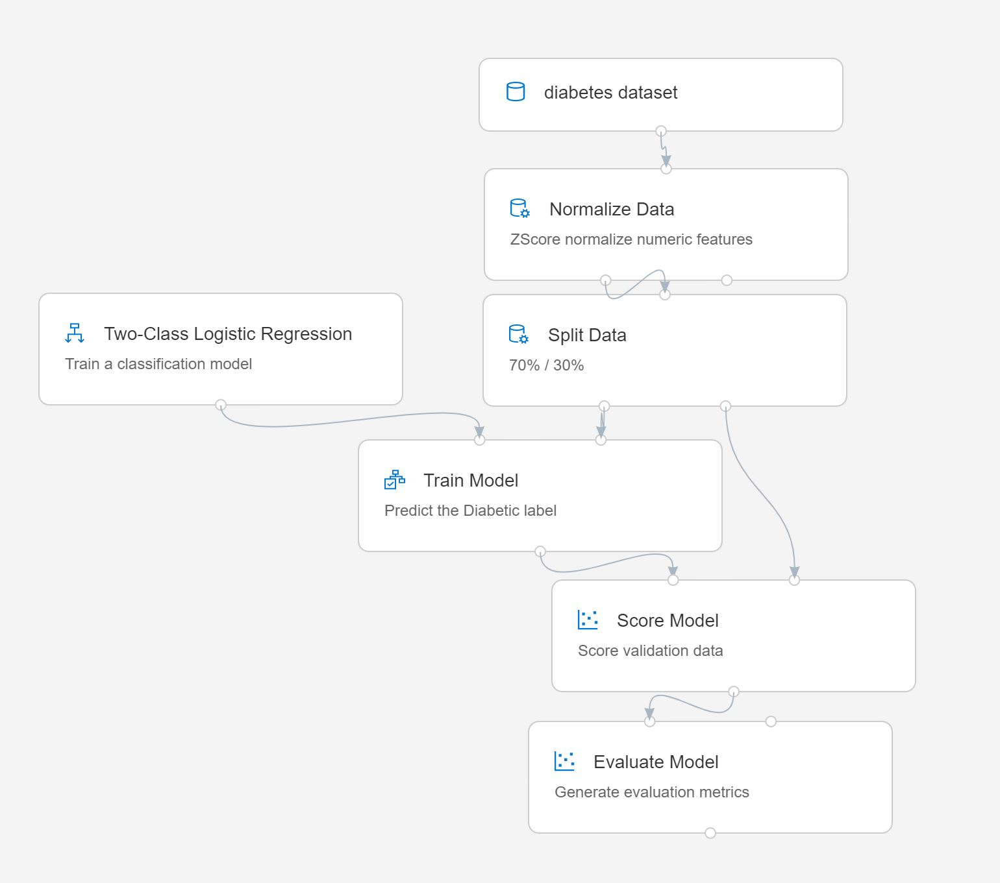

# Lab 2A: Tworzenie potoku treningowego za pomocą Azure ML Designer

*Designer* to interfejs typu „przeciągnij i upuść" (drag & drop), w którym składasz model uczenia maszynowego z gotowych klocków: pozyskania danych, ich transformacji i trenowania. Cały taki przepływ pracy nazywamy *potokiem* (pipeline). Gotowy potok można potem wdrożyć jako punkt końcowy czasu rzeczywistego, z którego aplikacje klienckie korzystają do *wnioskowania*, czyli generowania predykcji dla nowych danych.

## Zanim zaczniesz

Upewnij się, że masz ukończone ćwiczenia [Lab 1A](Lab01A.md) i [Lab 1B](Lab01B.md) - powstaje w nich obszar roboczy Azure Machine Learning oraz pozostałe zasoby używane tutaj.

## Krok 1: Tworzenie potoku w Designerze i eksploracja danych

Pracę z Designerem zaczyna się od utworzenia potoku i dodania do niego danych, na których chcesz pracować.

1. W [Azure Machine Learning studio](https://ml.azure.com), w swoim obszarze roboczym, przejdź na stronę **Designer** i utwórz nowy potok.
2. W panelu **Settings** zmień domyślną nazwę potoku (**Pipeline-Created-on-*data***) na **Visual Diabetes Training** (jeśli panel **Settings** nie jest widoczny, kliknij ikonę **&#9881;** obok nazwy potoku u góry).
3. Zwróć uwagę, że trzeba wskazać środowisko obliczeniowe, na którym potok będzie uruchamiany. W panelu **Settings** kliknij **Select compute target** i wybierz klaster **aml-cluster** utworzony w Lab 1A.
4. Po lewej stronie Designera rozwiń sekcję **Data** i przeciągnij na kanwę zasób danych **diabetes_dataset** zarejestrowany w Lab 1A.
5. Zaznacz moduł **diabetes_dataset** na kanwie i przejrzyj jego ustawienia. Następnie na karcie **outputs** kliknij ikonę **Visualize** (wygląda jak wykres kolumnowy).
6. Przejrzyj schemat danych, zwracając uwagę, że możesz zobaczyć rozkłady poszczególnych kolumn w postaci histogramów. Następnie zamknij wizualizację.

## Krok 2: Dodawanie transformacji

Zanim wytrenujesz model, dane zwykle trzeba wstępnie przetworzyć.

1. W panelu po lewej stronie rozwiń sekcję **Data Transformation**, która zawiera szeroki wybór modułów służących do transformowania i wstępnego przetwarzania danych przed trenowaniem modelu. Przeciągnij na kanwę moduł **Normalize Data**, poniżej modułu **diabetes_dataset**. Następnie połącz wyjście modułu **diabetes_dataset** z wejściem modułu **Normalize Data**.
2. Zaznacz moduł **Normalize Data** i przejrzyj jego ustawienia, zwracając uwagę, że wymaga on wskazania metody transformacji oraz kolumn, które mają zostać przekształcone. Zostaw metodę **ZScore** i ustaw listę kolumn tak, żeby zawierała:
    * PlasmaGlucose
    * DiastolicBloodPressure
    * TricepsThickness
    * SerumInsulin
    * BMI
    * DiabetesPedigree

    **Uwaga**: Normalizujemy kolumny liczbowe, aby sprowadzić je do tej samej skali i uniknąć sytuacji, w której kolumny o dużych wartościach dominują w trenowaniu modelu. W prawdziwym projekcie stosuje się zwykle cały zestaw takich przekształceń, ale w tym ćwiczeniu zostajemy przy jednym, najprostszym.

3. Teraz możemy podzielić dane na osobne zestawy do trenowania i walidacji. W panelu po lewej stronie, w sekcji **Data Transformations**, przeciągnij na kanwę moduł **Split Data**, pod modułem **Normalize Data**. Następnie połącz lewe wyjście *Transformed Dataset* modułu **Normalize Data** z wejściem modułu **Split Data**.
4. Zaznacz moduł **Split Data** i skonfiguruj jego ustawienia w następujący sposób:
    * **Splitting mode**: Split Rows
    * **Fraction of rows in the first output dataset**: 0.7
    * **Random seed**: 123
    * **Stratified split**: False

## Krok 3: Dodawanie modułów trenowania modelu

Po przygotowaniu danych i podzieleniu ich na zestawy treningowe i walidacyjne możesz skonfigurować potok tak, aby trenował i oceniał model.

1. Rozwiń sekcję **Model Training** w panelu po lewej stronie i przeciągnij na kanwę moduł **Train Model**, pod modułem **Split Data**. Następnie połącz lewe wyjście *Result dataset1* modułu **Split Data** z prawym wejściem *Dataset* modułu **Train Model**.
2. Model będzie przewidywał wartość **Diabetic**, więc zaznacz moduł **Train Model** i zmodyfikuj jego ustawienia, ustawiając **Label column** na **Diabetic** (dokładnie zgodnie z wielkością liter i pisownią!).
3. Etykieta **Diabetic**, którą model ma przewidywać, jest kolumną binarną (1 dla pacjentów chorych na cukrzycę, 0 dla pacjentów zdrowych), więc musimy wytrenować model za pomocą algorytmu *klasyfikacji*. Rozwiń sekcję **Machine Learning Algorithms** i w podsekcji **Classification** przeciągnij na kanwę moduł **Two-Class Logistic Regression**, na lewo od modułu **Split Data** i powyżej modułu **Train Model**. Następnie połącz jego wyjście z lewym wejściem **Untrained model** modułu **Train Model**.
4. Aby przetestować wytrenowany model, musimy użyć go do oceny zestawu walidacyjnego, który odłożyliśmy na bok podczas podziału oryginalnych danych. Rozwiń sekcję **Model Scoring & Evaluation** i przeciągnij na kanwę moduł **Score Model**, poniżej modułu **Train Model**. Następnie połącz wyjście modułu **Train Model** z lewym wejściem **Trained model** modułu **Score Model**, a prawe wyjście **Results dataset2** modułu **Split Data** przeciągnij do prawego wejścia **Dataset** modułu **Score Model**.
5. Aby ocenić, jak dobrze działa model, musimy przyjrzeć się metrykom wygenerowanym podczas oceny zestawu walidacyjnego. Z sekcji **Model Scoring & Evaluation** przeciągnij na kanwę moduł **Evaluate Model**, pod modułem **Score Model**, i połącz wyjście modułu **Score Model** z lewym wejściem **Score dataset** modułu **Evaluate Model**.

## Krok 4: Uruchamianie potoku treningowego

Po zdefiniowaniu kroków przepływu danych możesz teraz uruchomić potok treningowy i wytrenować model.

1. Sprawdź, czy Twój potok wygląda podobnie do poniższego (na obrazku każdy moduł ma komentarz opisujący, co robi - w prawdziwym projekcie warto tak robić):

    

2. W prawym górnym rogu kliknij **Run**. Gdy pojawi się pytanie o eksperyment, utwórz nowy *eksperyment* o nazwie **visual-training** i uruchom go. Azure najpierw uruchomi klaster, a dopiero potem sam potok, więc całość może potrwać 10 minut lub dłużej. Status widać w prawym górnym rogu, nad kanwą.

    **Wskazówka**: W trakcie działania potoku możesz go śledzić na stronie **Jobs** - każde uruchomienie potoku figuruje tam jako zadanie, pogrupowane w ramach eksperymentu **visual-training**. Po zakończeniu wróć do potoku **Visual Diabetes Training** na stronie **Designer**.

3. Po zakończeniu działania modułu **Normalize Data** (sygnalizowanym ikoną &#x2705;) zaznacz go i w panelu **Settings**, na karcie **Outputs**, w sekcji **Transformed dataset**, kliknij ikonę **Visualize** - zobaczysz statystyki i rozkłady przekształconych kolumn.
4. Zamknij wizualizacje modułu **Normalize Data** i poczekaj na zakończenie działania pozostałych modułów. Następnie zwizualizuj moduł **Evaluate Model**, aby zobaczyć metryki jakości modelu.

    **Uwaga**: Ten model nie radzi sobie zbyt dobrze - częściowo dlatego, że przygotowanie danych ograniczyliśmy do minimum. Możesz spróbować różnych algorytmów klasyfikacji i porównać wyniki (możesz połączyć wyjścia modułu **Split Data** z wieloma modułami **Train Model** i **Score Model**, a także podłączyć drugi oceniony model do modułu **Evaluate Model**, żeby porównać oba wyniki obok siebie). Celem tego ćwiczenia jest po prostu zapoznanie Cię z interfejsem Designera, a nie wytrenowanie idealnego modelu!
