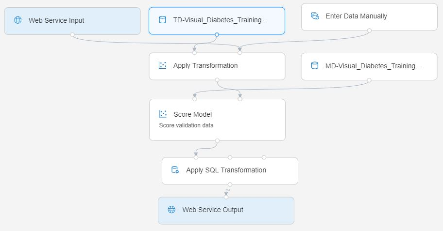

# Lab 2B: Wdrażanie punktu końcowego czasu rzeczywistego za pomocą Azure ML Designer

Skoro masz już wytrenowany model, możesz wykorzystać potok treningowy do utworzenia potoku wnioskowania służącego do oceny nowych danych.

## Zanim zaczniesz

Upewnij się, że masz ukończone ćwiczenia [Lab 1A](Lab01A.md) i [Lab 1B](Lab01B.md) - powstaje w nich obszar roboczy Azure Machine Learning oraz pozostałe zasoby używane tutaj. Potrzebny jest również [Lab 2A](Lab02A.md), w którym powstaje potok treningowy w Designerze.

## Krok 1: Przegląd zasobów obliczeniowych

> **Ważne - czym wdrożenie z Designera różni się od reszty kursu**: potok zbudowany w Lab 2A korzysta z *klasycznych, gotowych modułów* Designera (Normalize Data, Train Model, Score Model itd.). Potoki z tych modułów można wdrożyć **wyłącznie** do **Azure Container Instance (ACI)** albo do klastra **Azure Kubernetes Service (AKS)** - lista **Compute type** w oknie wdrożenia zawiera dokładnie te dwie pozycje i nic więcej.
>
> Zarządzane punkty końcowe online (*managed online endpoints*) - nowocześniejszy mechanizm z SDK v2, którego użyjesz w [Lab 7A](Lab07A.md) - **nie są dostępne** dla klasycznych potoków Designera. Stosuje się je przy wdrażaniu zarejestrowanego modelu z poziomu SDK/CLI v2 albo dla potoków zbudowanych z własnych komponentów (v2).
>
> W tym ćwiczeniu wdrożysz model do **Azure Container Instance**, bo nie wymaga tworzenia żadnych zasobów z wyprzedzeniem. ACI jest przeznaczone do scenariuszy deweloperskich i testowych - takich jak ten - a nie do produkcji.

1. W [Azure Machine Learning studio](https://ml.azure.com), na stronie **Compute** swojego obszaru roboczego, przejrzyj istniejące zasoby obliczeniowe na poszczególnych kartach. Powinny się wśród nich znaleźć:
    * **Compute Instances**: instancja obliczeniowa utworzona w poprzednim ćwiczeniu.
    * **Compute Clusters**: zasób obliczeniowy **aml-cluster** utworzony w poprzednim ćwiczeniu.
    * **Kubernetes clusters**: brak - i nie jest potrzebny, bo wdrażasz do ACI, a nie do AKS.
    * **Attached Compute**: brak (tutaj można by dołączyć maszynę wirtualną lub klaster Databricks istniejący poza obszarem roboczym).

2. Na karcie **Compute Instances**, jeśli Twoja instancja obliczeniowa jeszcze nie działa, uruchom ją - będzie potrzebna w dalszej części tego ćwiczenia.

## Krok 2: Tworzenie potoku wnioskowania

Gdy potok treningowy skończy działać, możesz przygotować na jego podstawie potok wnioskowania do wdrożenia.

1. Na stronie **Designer** otwórz potok **Visual Diabetes Training** utworzony w poprzednim ćwiczeniu.
2. Z listy rozwijanej **Create inference pipeline** wybierz **Real-time inference pipeline**. Po kilku sekundach zostanie otwarta nowa wersja potoku o nazwie **Visual Diabetes Training-real time inference**.
3. Zmień nazwę nowego potoku na **Predict Diabetes**, a następnie przejrzyj nowy potok. Zwróć uwagę, że transformacje i kroki trenowania zostały w nim zwinięte w gotowe moduły: statystyki policzone na danych treningowych posłużą teraz do normalizacji nowych danych, a wytrenowany model - do ich oceny.
4. Potok wnioskowania zakłada, że nowe dane będą zgodne ze schematem oryginalnych danych treningowych, dlatego w potoku znajduje się moduł **diabetes_dataset** z potoku treningowego. Te dane zawierają jednak etykietę **Diabetic**, czyli to, co model ma dopiero przewidzieć - a w danych nowego pacjenta takiej kolumny z założenia nie ma. Usuń ten moduł i zastąp go modułem **Enter Data Manually** z sekcji **Data Input and Output**, podłączonym do tego samego wejścia **dataset** modułu **Apply Transformation**, do którego podłączone jest **Web Service Input**. Następnie zmodyfikuj ustawienia modułu **Enter Data Manually**, aby użyć następujących danych wejściowych CSV, które zawierają wartości cech bez etykiet dla trzech nowych obserwacji pacjentów:

    ```CSV
    PatientID,Pregnancies,PlasmaGlucose,DiastolicBloodPressure,TricepsThickness,SerumInsulin,BMI,DiabetesPedigree,Age
    1882185,9,104,51,7,24,27.36983156,1.350472047,43
    1662484,6,73,61,35,24,18.74367404,1.074147566,75
    1228510,4,115,50,29,243,34.69215364,0.741159926,59
    ```

5. Potok wnioskowania zawiera moduł **Evaluate Model**, który nie jest przydatny podczas przewidywania na podstawie nowych danych, więc usuń ten moduł.
6. Wyjście z modułu **Score Model** zawiera wszystkie cechy wejściowe, a także przewidywaną etykietę i wynik prawdopodobieństwa. Aby ograniczyć wyjście tylko do predykcji i prawdopodobieństwa, usuń połączenie między modułem **Score Model** a **Web Service Output**, dodaj moduł **Apply SQL Transformation** z sekcji **Data Transformations**, połącz wyjście modułu **Score Model** z lewym wejściem **t1** modułu **Apply SQL Transformation**, a wyjście modułu **Apply SQL Transformation** połącz z **Web Service Output**. Następnie zmodyfikuj ustawienia modułu **Apply SQL Transformation**, aby użyć następującego zapytania SQL:

    ```SQL
    SELECT PatientID,
           [Scored Labels] AS DiabetesPrediction,
           [Scored Probabilities] AS Probability
    FROM t1
    ```

7. Sprawdź, czy Twój potok wygląda podobnie do poniższego:

    

8. Uruchom potok jako nowy eksperyment o nazwie **predict-diabetes** na klastrze **aml-cluster** - tym samym, na którym trenowany był model. Może to chwilę potrwać.

## Krok 3: Wdrażanie punktu końcowego czasu rzeczywistego

Masz już potok wnioskowania czasu rzeczywistego, który możesz wdrożyć jako punkt końcowy dla aplikacji klienckich.

1. Wróć do karty **Designer** i ponownie otwórz swój potok wnioskowania **Predict Diabetes**. Jeśli jego uruchomienie jeszcze się nie zakończyło, poczekaj na jego zakończenie. Następnie zwizualizuj wyjście modułu **Apply SQL Transformation**, aby zobaczyć przewidziane etykiety i prawdopodobieństwa dla trzech obserwacji pacjentów w danych wejściowych.
2. W prawym górnym rogu kliknij **Deploy**. W oknie **Set up real-time endpoint** ustaw:
    * zaznacz **Deploy new real-time endpoint**,
    * **Name**: predict-diabetes
    * **Compute type**: **Azure Container Instance**

    > **Dlaczego akurat to**: lista **Compute type** zawiera tylko dwie pozycje - **AksCompute** i **Azure Container Instance**. To jedyne środowiska, jakie obsługują klasyczne potoki Designera. Wybierz **Azure Container Instance**: kontener powstaje na żądanie, więc nie musisz wcześniej niczego tworzyć. Wybór **AksCompute** wymagałby najpierw założenia (i opłacania) klastra Kubernetes.
    >
    > Sekcję **Advanced** możesz rozwinąć, aby zmienić przydział procesora i pamięci dla kontenera albo ustawienia uwierzytelniania. Na potrzeby tego ćwiczenia ustawienia domyślne są w porządku.

3. Poczekaj na wdrożenie punktu końcowego - może to potrwać kilka minut. Status wdrożenia jest wyświetlany w lewym górnym rogu interfejsu Designera.

    > **Wskazówka**: W czasie oczekiwania warto przejrzeć dokumentację Azure Machine Learning Designer pod adresem [https://learn.microsoft.com/azure/machine-learning/concept-designer](https://learn.microsoft.com/azure/machine-learning/concept-designer).

## Krok 4: Testowanie punktu końcowego

Teraz możesz przetestować wdrożony punkt końcowy z poziomu aplikacji klienckiej - tutaj będzie nią notatnik na Twojej instancji obliczeniowej.

1. Na stronie **Endpoints** otwórz punkt końcowy czasu rzeczywistego **predict-diabetes**.
2. Gdy otworzy się punkt końcowy **predict-diabetes**, na stronie **Test** zwróć uwagę na domyślne parametry wejściowe testu, a następnie kliknij **Test**, aby przesłać je do wdrożonego punktu końcowego i wygenerować predykcję.
3. Na karcie **Consume** zwróć uwagę na **REST endpoint** (URI do oceny) punktu końcowego oraz klucz uwierzytelniania, a także obejrzyj przykładowy kod dostarczony dla języka **Python**. Skopiuj cały przykładowy skrypt Python do schowka.
4. Na stronie **Compute**, jeśli Twoja instancja obliczeniowa jeszcze nie działa, poczekaj na jej uruchomienie. Następnie kliknij jej link **JupyterLab**.
5. W JupyterLab, w folderze `~/cloudfiles/code/Users/<nazwa-użytkownika>/MachineLearningCourse/materialy/azure-ml/pl`, otwórz **02B - Using the Visual Designer.ipynb**.
6. W notatniku wklej skopiowany kod do pustej komórki kodu. Przykładowy kod wysyła żądanie do URI oceny punktu końcowego, uwierzytelniając się kluczem punktu końcowego.
7. Uruchom komórkę kodu i przejrzyj dane wyjściowe zwrócone przez Twój punkt końcowy.

## Krok 5: Usuwanie punktu końcowego

Wdrożenie w Azure Container Instance działa - i nalicza koszty - dopóki punkt końcowy istnieje, więc usuń go po zakończeniu pracy. Ponieważ wdrażaliśmy do ACI, a nie do AKS, nie zostaje po tym żaden osobny klaster: usunięcie punktu końcowego kasuje utworzony dla niego kontener.

1. W Azure Machine Learning studio, na stronie **Endpoints** swojego obszaru roboczego, wybierz punkt końcowy **predict-diabetes**. Następnie kliknij przycisk **Delete** (&#128465;) i potwierdź, że chcesz usunąć punkt końcowy.

> **Uwaga**: Jeśli zamierzasz przejść od razu do [kolejnego ćwiczenia](Lab03A.md), pozostaw instancję obliczeniową uruchomioną. Jeśli robisz przerwę, warto zamknąć karty Jupyter i **zatrzymać** (Stop) instancję obliczeniową, aby uniknąć niepotrzebnych kosztów.
